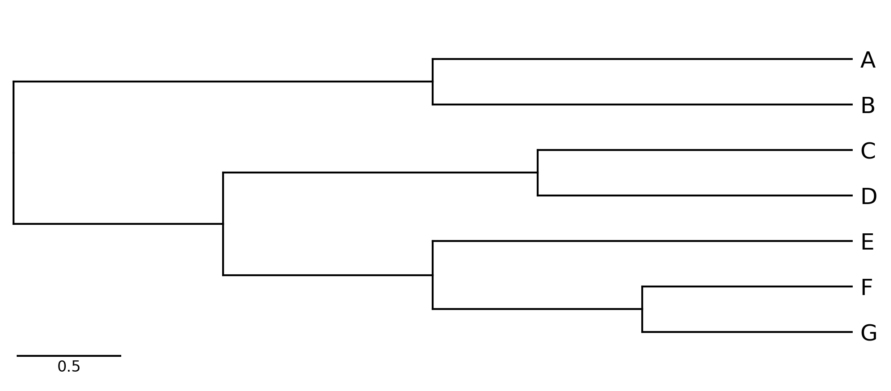
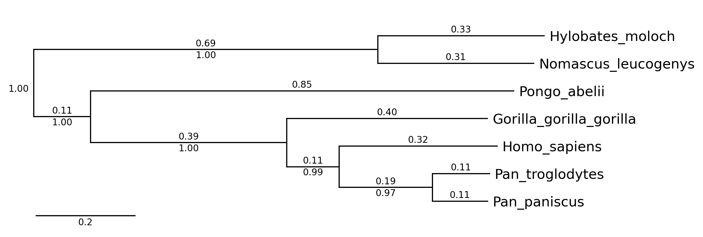
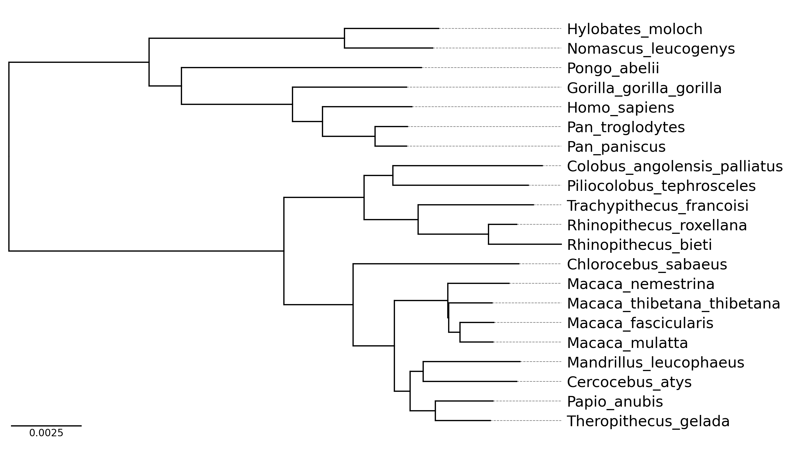

# phyTreeViz CLI Document

## Usage

### Basic Command

    phytreeviz -i [Tree file or text] -o [Tree visualization file]

### Options

    General Options:
      -i IN, --intree IN      Input phylogenetic tree file or text
      -o OUT, --outfile OUT   Output phylogenetic tree plot file [*.png|*.jpg|*.svg|*.pdf]
      --format                Input phylogenetic tree format (Default: 'newick')
      -v, --version           Print version information
      -h, --help              Show this help message and exit

    Figure Appearence Options:
      --fig_height            Figure height per leaf node of tree (Default: 0.5)
      --fig_width             Figure width (Default: 8.0)
      --leaf_label_size       Leaf label size (Default: 12)
      --ignore_branch_length  Ignore branch length for plotting tree (Default: OFF)
      --align_leaf_label      Align leaf label position (Default: OFF)
      --show_branch_length    Show branch length (Default: OFF)
      --show_confidence       Show confidence (Default: OFF)
      --dpi                   Figure DPI (Default: 300)

    Available Tree Format: ['newick', 'phyloxml', 'nexus', 'nexml', 'cdao']

### Example Command

Click [here](https://github.com/moshi4/phyTreeViz/raw/main/example/example.zip) to download example tree files.  

#### Example 1

    phytreeviz -i "((A,B),((C,D),(E,(F,G))));" -o cli_example01.png

  

#### Example 2

    phytreeviz -i ./example/small_example.nwk -o cli_example02.png \
               --show_branch_length --show_confidence

  

#### Example 3

    phytreeviz -i ./example/medium_example.nwk -o cli_example03.png \
               --fig_height 0.3 --align_leaf_label 

  
