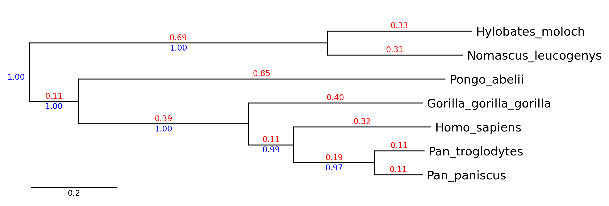
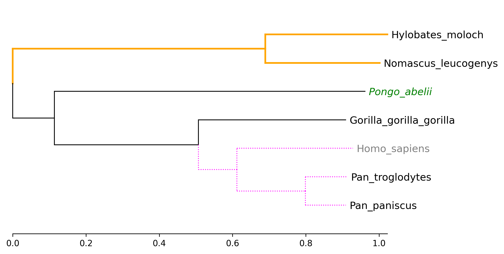
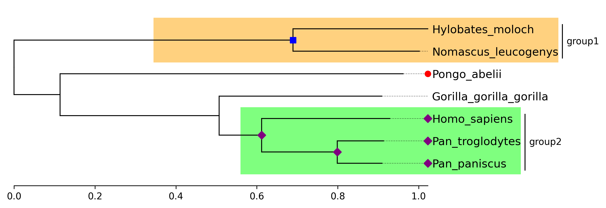
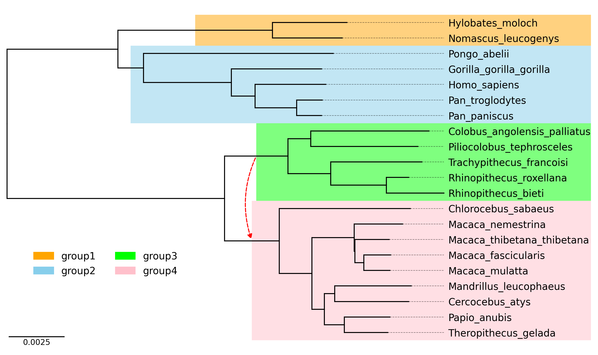

# phyTreeViz

## Overview

phyTreeViz is a simple and minimal phylogenetic tree visualization python package implemented based on matplotlib.
This package was developed to enhance phylogenetic tree visualization functionality of BioPython.

phyTreeViz is intended to provide a simple and easy-to-use phylogenetic tree visualization function without complexity.
Therefore, if you need complex tree annotations, I recommend using [ete](https://github.com/etetoolkit/ete) or [ggtree](https://github.com/YuLab-SMU/ggtree).

## Installation

`Python 3.8 or later` is required for installation.

**Install PyPI package:**

    pip install phytreeviz

## Examples

___

___

___

